This is the main branch line (HOTFIX)

## Assignment Screenshots

### Phase 1: Local Repository Initialization and Initial Commit

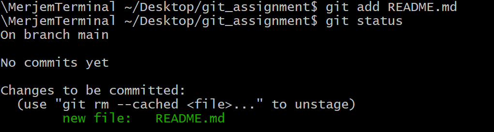
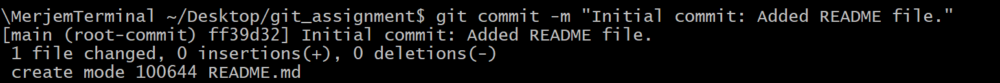

### Phase 2: Remote Setup and Synchronization
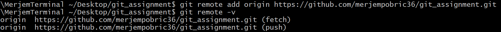
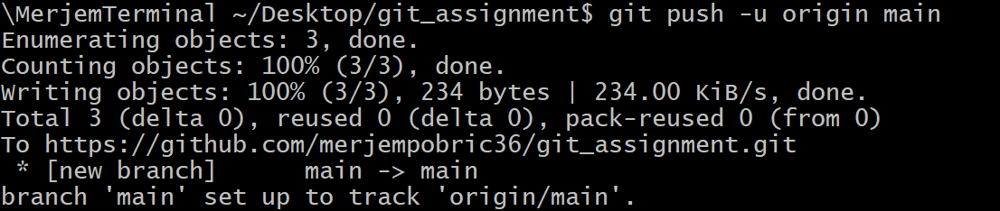

### Phase 3: Branching, Changes, and Rebase
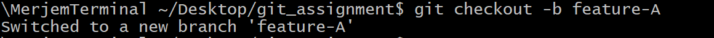
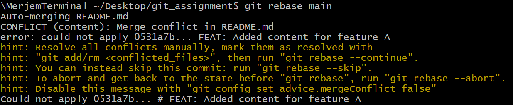
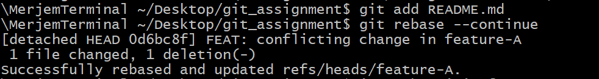
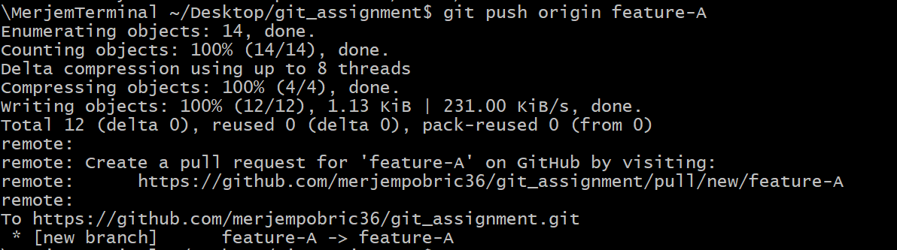
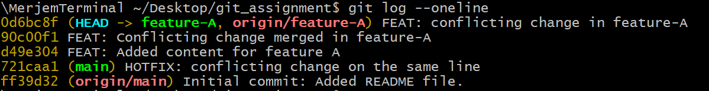

### Phase 5: Branch Integration
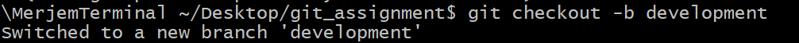
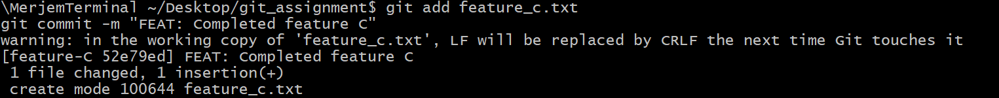
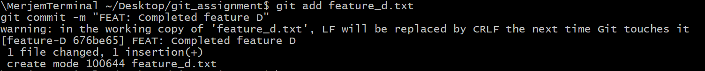
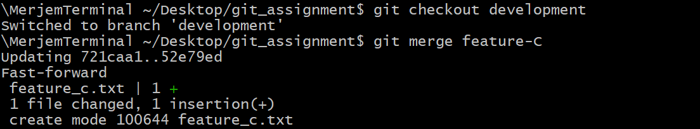
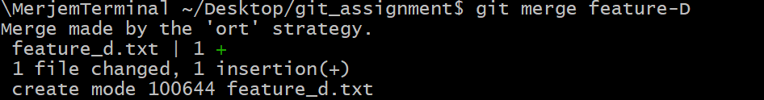
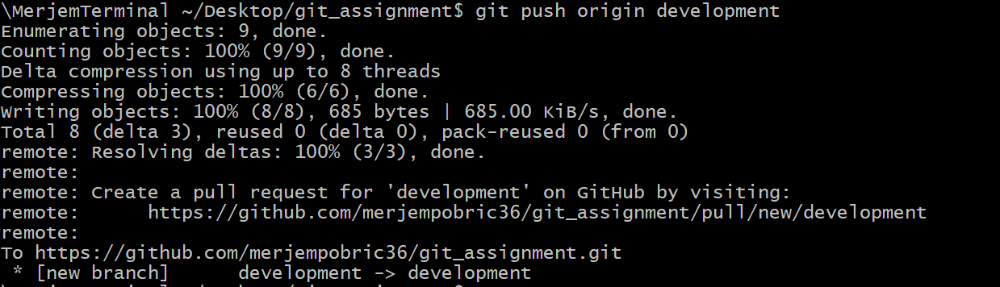
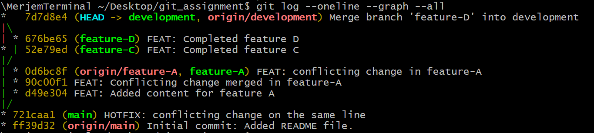